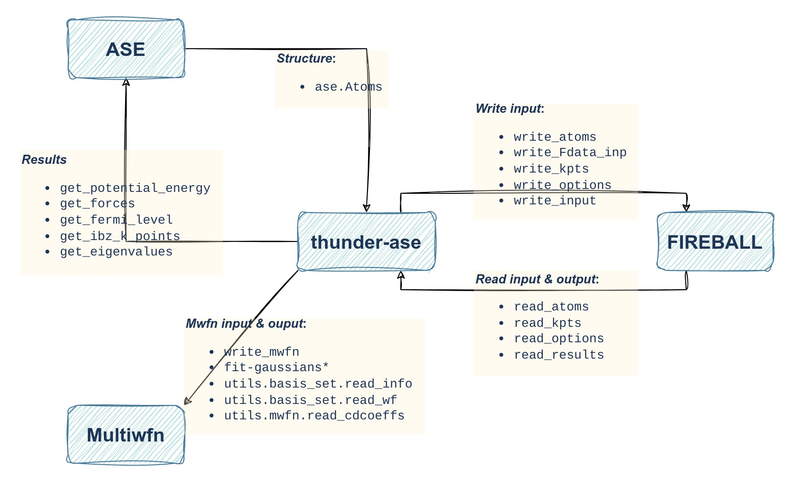

[](https://github.com/thunder-dft/thunder-ase/actions/workflows/python-publish.yml)

# Thunder ASE

### Description
The interface of ASE for FIREBALL.

[FIREBALL](https://fireball-dft.org) is an open source and high efficiency DFT software based on local-orbital ab-initio method, allows for the simulation very large supercells of thousands of atoms. [ASE](https://wiki.fysik.dtu.dk/ase/index.html) is a popular python package for atomic structure modeling. ASE provide interfaces with many QM and MM software. This `thunder-ase` package is not only the ASE interface for FIREBALL, but also provides many other useful functions. 



### Installation

`pip install -U thunder-ase`

#### Requirements

* ase

### Tutorial

#### Simple example

```Python
from thunder_ase.fireball import Fireball
from ase.build import molecule

atoms = molecule('C6H6')
Fdata_path = 'YOUR_FDATA_PATH'

kwargs = {'iwriteout_charges': 1,  # Writing out the charges.
          'efermi_T': 200.0,
          'max_scf_iterations_set': 100,
          'scf_tolerance_set': 0.00000001,
          'beta_set': 0.04,
          }

calc = Fireball(command='YOUR_PATH for fireball.x', 
                Fdata_path=Fdata_path,
                **kwargs)
atoms.set_calculator(calc)

e0 = atoms.get_potential_energy()
efermi = atoms.calc.get_fermi_level()

print("The energy is {:.3f} eV.".format(e0))
print("The Fermi Level is {:.3f} eV.".format(efermi))
```

#### Basic Parameters of FIREBALL

* `qstate` : The charge state of the system. Default is 0. Positive values mean add extra electrons, negatives mean remove electrons.
* `efermi_t`: Smearing temperature at Fermi level. Default is 100.0, which is about 0.0086 eV. For metal system, larger value is recommended.
* `max_scf_iterations_set`: Scf steps maximum. Default is 50.
* `scf_tolerance_set`: Scf tolerance of charge. Default is 1.0E-6. Smaller value is recommended for higher precision, e.g. 1.0E-8.
* `beta_set`: Broyden’s mix factor of charges. Default is 0.08.
* `ecut_set`: To control mesh grid density. Default is 200.0.
* `iwriteout_charges`: Write out charges. Default is  0 (False).

#### Basic Parameters of Thunder-ASE

* `kpt_size`: Size of k point sampling. Default is None for molecules and [1, 1, 1] for crystals.
* `kpt_offset`: Offset for k point sampling. Default is None for molecules and [0., 0., 0.] for crystals.
* `kpt_interval`: Define kpoint sampling by the interval. Default is None.
* `kpt_path`: K points path to obtain band structure. Default is None. See more in [`ase.dft.kpoints.BandPath`](https://wiki.fysik.dtu.dk/ase/ase/dft/kpoints.html#band-path).
* `nkpt`: Number of kpoints on path. Default is None. Used if `kpt_path` is defined by string.
* `kpt_reduced`: (Experimental!) Whether reduce the k points. Default is False.

#### Advanced Parameters of FIREBALL

* `iconstraint_rcm`: Whether shifts molecule to center of mass (COM) before the simulation. Default is 1 (True).
* `ifix_neighbors`: Fix the neighbor list of the system to initial structure. Default is  0 (False).
* `ifix_charges`: Fix the charges of the system to initial structure. Default is  0 (False). This is useful sometimes for very unreasonable initial structures.
* `iwriteout_me_sandh`: Write out overlap (S) and Hamiltonian (H) matrix. Default is 0 (False).
* `iwriteout_cdcoeffs`: Write out orbital coefficients. Default is 0 (False).
* `iwriteout_density`: Write out density matrix. Default is  0 (False).
* `iwriteout_energies`: Write out all energy terms. Default is  0 (False).
* `iwriteout_populations`: Measure the localization by the entropic quantity W. Default is  0 (False). W is the number of accessible atoms for the given electronic energy and which describes the spatial extent of the electronic state. See more in Refs. H. Wang and J. P. Lewis, J. Phys.: Condens. Matter 18, 421–434 (2005) and  H. Wang and J. P. Lewis, J. Phys.: Condens. Matter 17, L209–L213 (2005).
* `iwriteout_forces`: Write out all force terms. Default is  0 (False).
* `iwriteout_neighbors`: Write out all neighbors. Default is  0 (False).
* `iwriteout_abs`: Write out  absorption spectra. Default is  0 (False).
* `iwriteout_ewf`: Write out  wavefuncion. Default is  0 (False).
* `iwriteout_dos`: Write out  density of states. Default is  0 (False).

#### Deprecated Parameters of FIREBALL

The following parameters are deprecated due to the usage of thunder-ase. In the future, they will be removed from FIREBALL. Most parameters are for MD simulations.

* `nstepi`: Initial step number. Default is 1.
* `iconstraint_vcm`: Constraining the velocities about the COM, it means whether fix  the COM during simulation. Default is 1 (True).
* `iconstraint_l`: Angular momentum constraint of the whole system. Default is  0 (False).
* `iconstraint_ke`: Kinetic energy constraint of the whole system. Default is  0 (False).
* `nstepf`: Final step number. Default is 1. `nstepf - nstepi` is the required MD steps.
* `t_initial`: Initial temperature of MD simulation. Default is 300.0. 
* `t_final`: Final temperature of MD simulation. Default is 0.. 
* `iquench`: Quench method. Default is 0. 
  * `iquench = n`: quench the velocities on every n’th step; 
  * `iquench = -1`: quench whenever the instantaneous temperature `T_instantaneous` is lower than the instantaneous temperature on the previous step `T_previous`;
  * `iquench = -2`: annealing simulation.  `T_want` is the desired annealing temperature and `taurelax` is for specifies how rapidly of quench;
  * `iquench = -3`: Coordinate power quench, quench velocities one coordinate at a time.
* `t_want`: Annealing temperature to reach.  Default is 300.0 K.
* `taurelax`: Quench rate. Default is 5.0 fs.
* `dt`: Time step of MD simulation. Default is 0.25 fs.
* `iensemble`: Thermodynamic ensemble. Default is 0.
  * `iensemble = 1`: Constant temperature ensemble
* `rho_surface_min` and `rho_surface_max`: Electron density minimum and maximum for XCrySDen Structure File. Default are 0.5E-3 and 0.1. 


## Roadmap

* v0.1: run basic fireball calculation and read basic result from it.
  * jupyter-notebook for examples
  * multiple atoms for one calculator
  * read fireball input to construct calculator
* v0.2: band structure calculation.
  * DOS calculation.
* v0.3: fit basis to gaussian basis set, write orbitals to mwfn.
  * interface to multiwfn.
* v0.4: Read charges and support charged system.
* v0.5: interactive running.
* v0.6: Fdata management.
